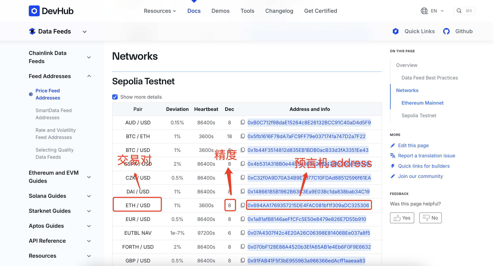

1、安装 @chainlink/contracts

```
npm install @chainlink/contracts --save-dev
```

2、获取chainlink 价格预言机地址

```
https://docs.chain.link/data-feeds/price-feeds/addresses?network=ethereum&page=1
```



3、导入AggregatorV3Interface
```
import {AggregatorV3Interface} from "@chainlink/contracts/src/v0.8/shared/interfaces/AggregatorV3Interface.sol";
```

4、获取ETH / USD 交易对价格
```
priceFeed = AggregatorV3Interface(DATA_FEED_ADDRESS);
(, int256 answer, , , ) = priceFeed.latestRoundData();
```

5、注意 转换后要除以精度